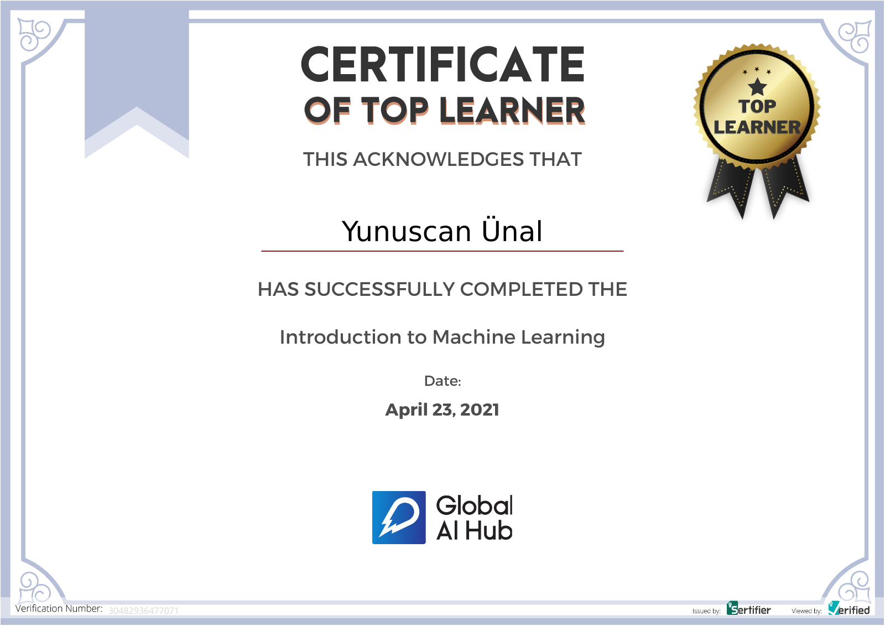

# GAIH Student Repo Example


**Course Date:** 19.04.2021 - 23.04.2021 

**Name:** Yunuscan 

**Surname:** Ünal 

**Email:** yunuscanunal1@gmail.com 

**Note:** Your homeworks can be formats like ".ipynb" and ".py". **Not ".txt" files!!** Make sure that your codes works.  

## My Project
This project is for learning and practicing about Machine Learning. This project done for being a one of Top Learner in Global AI Community.

This project is about Wine Quality. This dataset include acidity of wines, levels of density of wines or percentage of alcohol level of wines and quality of wines like that. Moreover, this dataset's format is csv format and this dataset is included 1600 row and 12 columns (features).

In this project, I used some python libraries: 
NumPy
Pandas
Matplodlib
Seaborn
Sci-kit Learn

## Requirements
```
Wİne Quality Dataset
Some Python Libraries such as Numpy, Pandas, Matplodlib for analyzing
Some Python Libraries such as Sklearn for modelling and statistic calculation

```
---

### Certification


